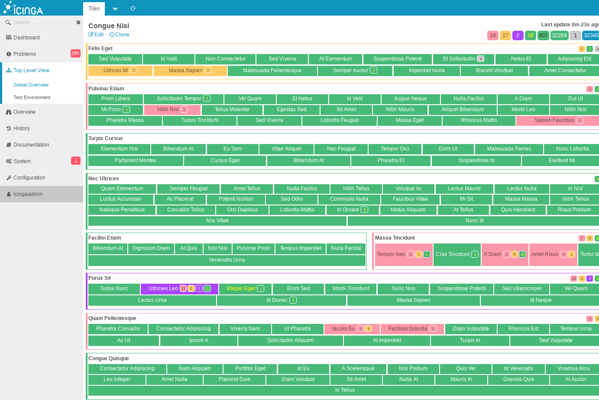

Top Level View for Icinga Web 2
===============================

Top Level View is a hierarchy based status view for Icinga Web 2.

You can define a hierarchical structure containing hosts, services and hostgroups.
And the view presents you an overview of the overall status of the sub-hierarchies.

With a caching layer, this view can aggregate thousands of status objects and make
them easily available for overview and drill down.

This view extends the status logic and behavior of Icinga Web 2 a bit,
please see the documentation on details.

## Requirements

* Icinga Web 2 >= 2.5.0
  * and its monitoring module
* php-yaml

Also see [Introduction in docs](doc/01-Introduction.md).

## Documentation

All documentation can be found inside the [doc](doc/) directory.

Also available inside Icinga Web 2 with the doc module.

## Development Environment

    ./test/setup_vendor.sh

    cp docker-compose.dev.yml docker-compose.yml
    # adjust to your needs

    docker-compose up -d

Then access [http://localhost:8080](http://localhost:8080).

Default admin user is `icingaadmin` with password `icinga`.

## License

    Copyright (C) 2017 Icinga Development Team <info@icinga.com>

    This program is free software; you can redistribute it and/or modify
    it under the terms of the GNU General Public License as published by
    the Free Software Foundation; either version 2 of the License, or
    (at your option) any later version.

    This program is distributed in the hope that it will be useful,
    but WITHOUT ANY WARRANTY; without even the implied warranty of
    MERCHANTABILITY or FITNESS FOR A PARTICULAR PURPOSE.  See the
    GNU General Public License for more details.

    You should have received a copy of the GNU General Public License along
    with this program; if not, write to the Free Software Foundation, Inc.,
    51 Franklin Street, Fifth Floor, Boston, MA 02110-1301 USA.
