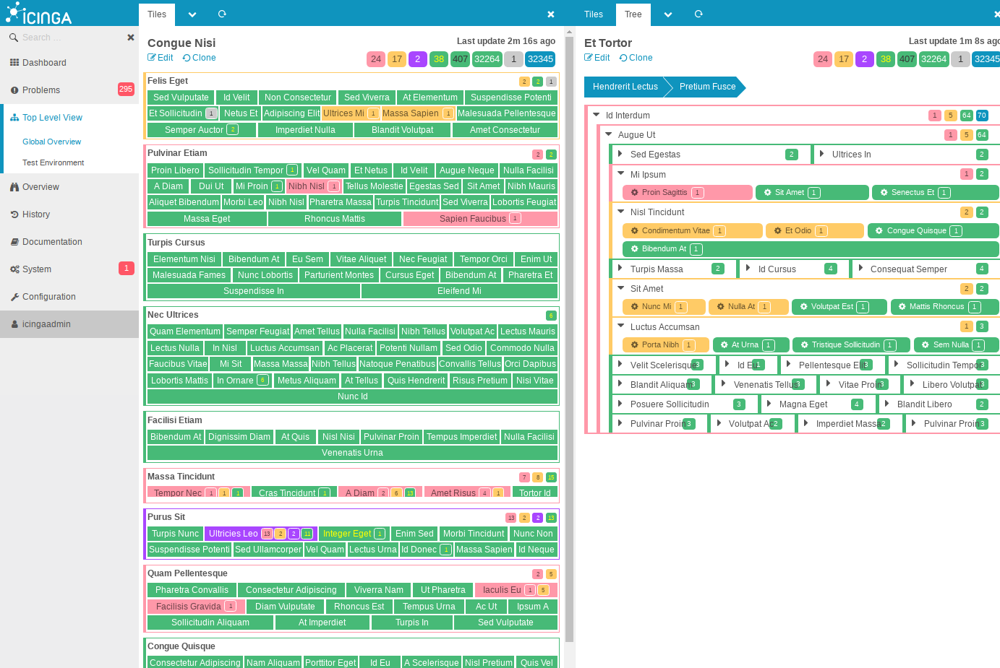
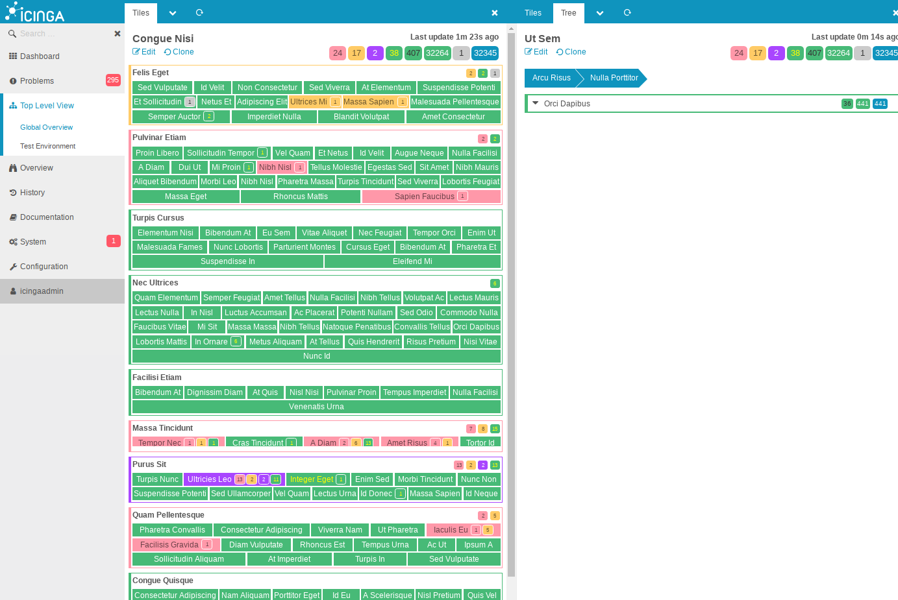
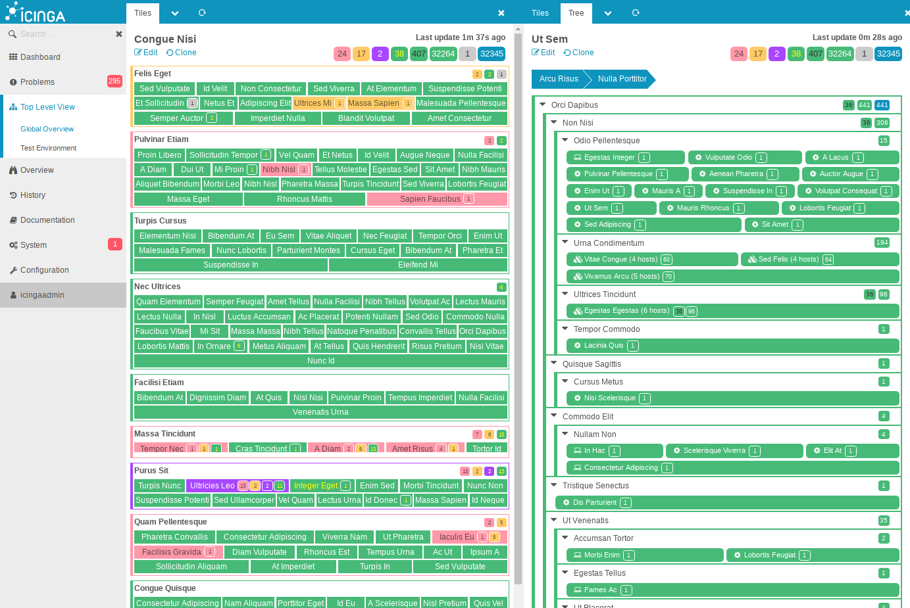
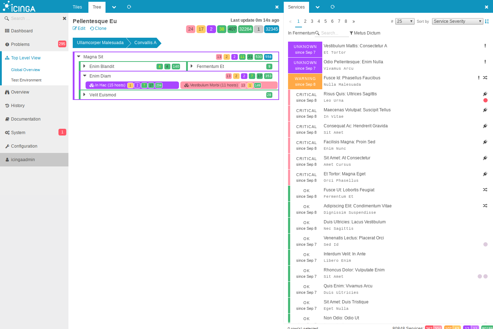
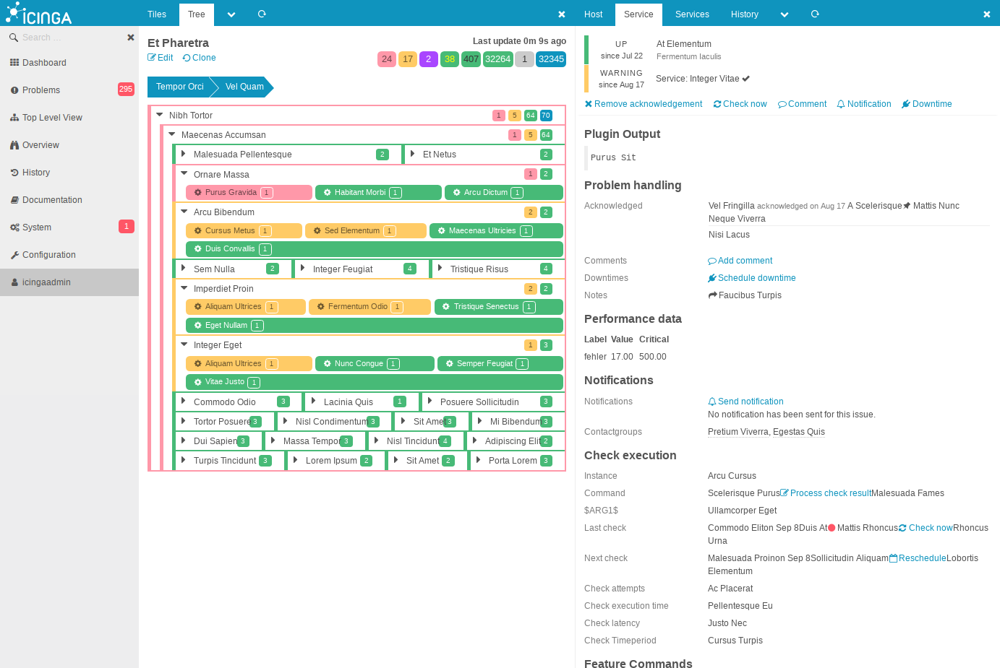
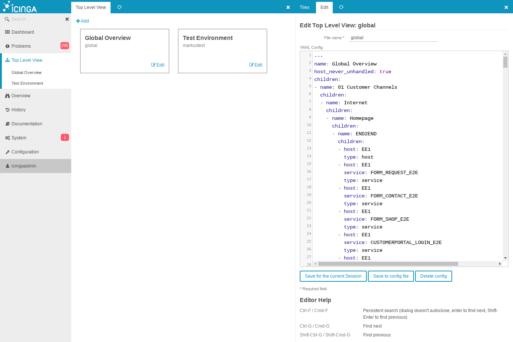

Screenshots
===========

Tile view with lots of objects:

Tile and Tree view with problems:

Tree view with no problems (all collapsed):

Tree view with no problems (expanded by user):

Tree view problems on a hostgroup, and the hostgroup details:

Tree view problems on services, and the service details:

Overview over all defined views, and the open editor:

